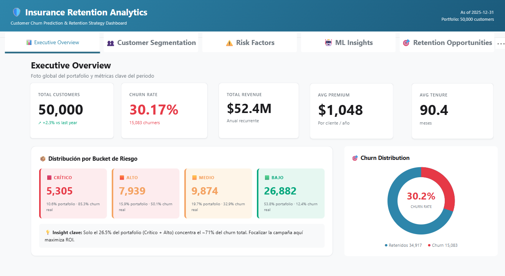
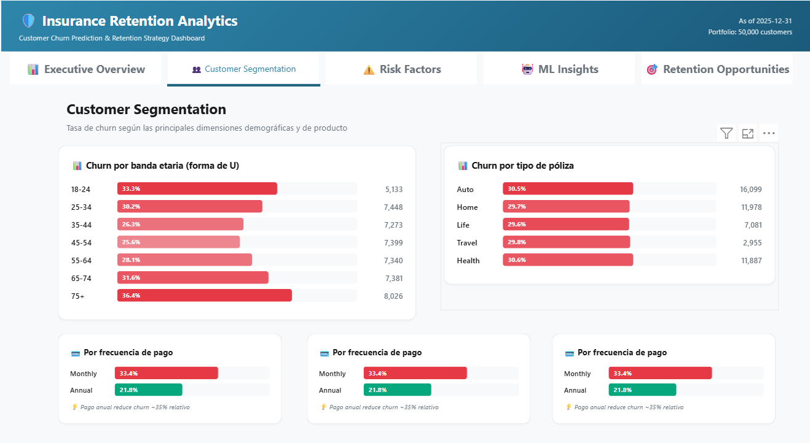
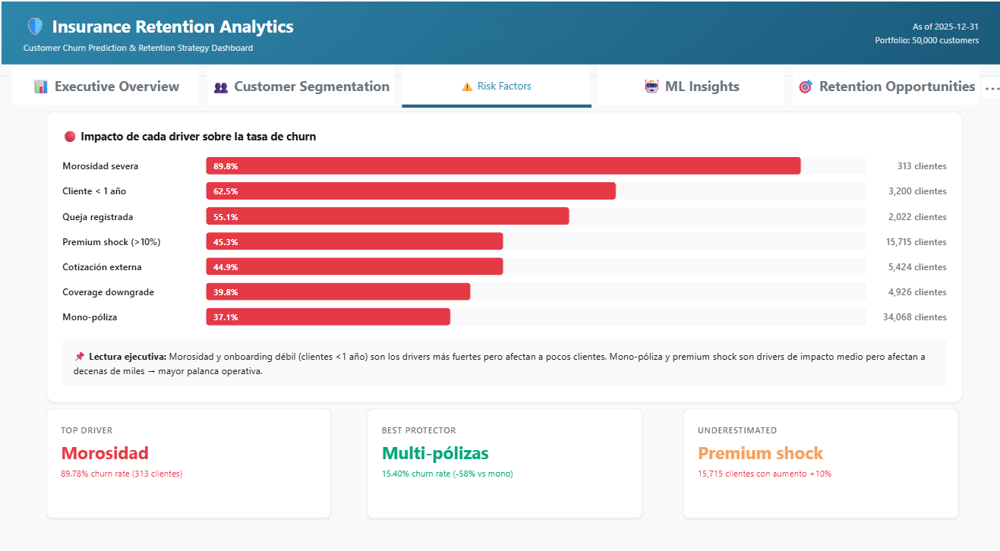
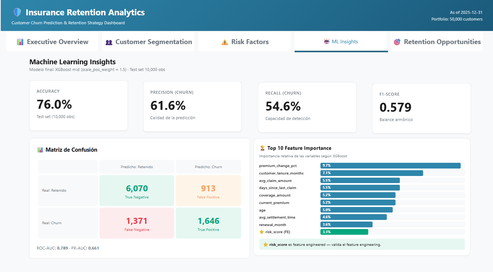
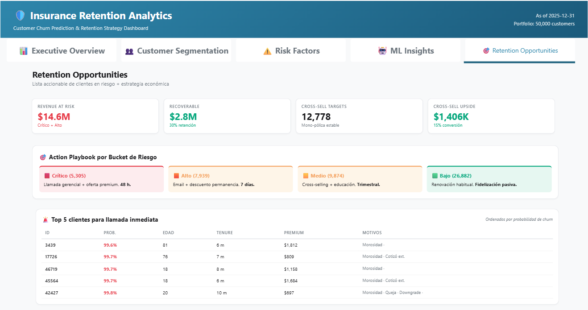

# Insurance Retention Analytics

> Predicción de churn y estrategia de retención para una cartera de 50,000 pólizas de seguros, con dashboard ejecutivo accionable.


---

## De qué va este proyecto

La cartera tiene 50,000 clientes y el 30.17% se va cada año. Eso son ~$14.6M de ingresos en riesgo. El proyecto intenta responder tres preguntas concretas:

1. **¿Quiénes se van a ir?** — modelo de clasificación que devuelve probabilidad de churn por cliente.
2. **¿Por qué?** — qué variables están detrás (importancia + SHAP), para que el negocio pueda actuar sobre las causas y no solo sobre los síntomas.
3. **¿Qué hago con esa información?** — buckets de riesgo (Crítico/Alto/Medio/Bajo) con un playbook de acciones distinto para cada uno.

Todo termina en un dashboard de 5 páginas que cualquier persona del equipo de retención puede abrir y entender en 30 segundos.


---

## Resultados que importan

**Del modelo:**

| Métrica | Valor |
|---|---|
| ROC-AUC | 0.789 |
| PR-AUC | 0.661 |
| Precision (churn) | 61.6% |
| Recall (churn) | 54.6% |
| F1-score | 0.579 |

Un poco más de la mitad de los churners se detectan antes de irse, con 6 de cada 10 alertas acertando. Para el caso de negocio (donde un falso positivo cuesta $15 en email y un falso negativo cuesta $1,200 de cliente perdido) eso es suficiente para que la campaña sea rentable.

**Del negocio:**

- 5,305 clientes en bucket **Crítico** (10.6% de la cartera) concentran el 30% del churn.
- Solo un 26.5% del portafolio (Crítico + Alto) concentra ~71% del churn total → priorización clara.
- Si el equipo retiene al 30% de los clientes Crítico+Alto, se recuperan **~$4.4M anuales**.
- 12,778 clientes mono-póliza estables → oportunidad de cross-sell estimada en **$1.4M**.

**Lo que más me sorprendió:**

- Los clientes con **<1 año de antigüedad** churnan al 62.5%. Onboarding débil es un driver mucho más fuerte de lo que parecía.
- **Premium shock >10%** (subida fuerte de prima) afecta a 15,715 clientes con 45% de churn — el driver con más palanca operativa.

---

## Dashboard

5 páginas en Power BI. La idea es que cada una responda una pregunta distinta:

| Página | Pregunta que responde |
|---|---|
| **Executive Overview** | ¿Cómo está la cartera ahora? |
| **Customer Segmentation** | ¿Quiénes son los clientes que más se van? |
| **Risk Factors** | ¿Por qué se van? |
| **ML Insights** | ¿Qué tan confiable es el modelo? |
| **Retention Opportunities** | ¿Qué hago la semana que viene? |

### Screenshots

**1. Executive Overview**


**2. Customer Segmentation**


**3. Risk Factors**


**4. ML Insights**


**5. Retention Opportunities**


---

## Cómo está organizado el repo

```
insurance-retention-analytics/
├── data/
│   ├── raw/                       CSV original (50K x 40 cols)
│   └── processed/                 Datasets después de feature engineering
├── notebooks/
│   ├── 01_data_understanding.ipynb
│   ├── 02_eda.ipynb
│   ├── 03_data_preparation.ipynb
│   ├── 04_modeling.ipynb
│   ├── 05_evaluation.ipynb
│   ├── 06_feature_importance.ipynb
│   └── 07_business_insights.ipynb
├── src/
│   ├── data_loader.py             Carga reproducible del dataset
│   ├── preprocessing.py           Feature engineering centralizado
│   └── modeling.py                Entrenamiento + scoring
├── sql/
│   ├── 01_create_database.sql
│   ├── 02_create_tables.sql
│   ├── 03_load_data.sql           BULK INSERT desde CSVs procesados
│   ├── 04_views_kpis.sql          5 vistas analíticas (capa semántica)
│   └── 05_analytical_queries.sql  10 queries de negocio
├── powerbi/
│   ├── Insurance_Retention_Analytics.pbix
│   ├── insurance_theme.json       Theme corporativo
│   └── measures.dax               70+ medidas DAX exportadas
├── models/
│   ├── xgb_mid_final.pkl
│   └── feature_names.pkl
├── reports/
│   └── figures/                   Gráficos de notebooks + screenshots dashboard
└── docs/
    └── architecture_diagram.html
```

---

## Stack y por qué cada pieza

**Python (notebooks + src):**
- `pandas`, `scikit-learn`, `xgboost`, `shap`, `matplotlib`, `seaborn`
- Notebooks para exploración. Módulos `src/` para lo que después se podría usar en producción (carga, preprocesamiento, scoring).

**SQL Server 2019:**
- Persistencia del modelo scoreado (50K predicciones).
- 5 vistas como **capa semántica**: Power BI no toca las tablas raw, consume las vistas. Si mañana cambia el cálculo de un KPI se hace en la vista y no se toca el dashboard.

**Power BI Desktop:**
- 70+ medidas DAX (numéricas + display separadas).
- Diseño con HTML/CSS embebido en DAX para los visuales custom — el Card moderno de Power BI tiene varias limitaciones para un dashboard ejecutivo, así que reemplacé varios con `HTML Content` + DAX devolviendo HTML.
- Theme JSON corporativo unificado.

---

## Cómo correrlo

### Requisitos

- Python 3.11
- SQL Server 2019 (o superior)
- Power BI Desktop

### 1. Setup del entorno

```bash
git clone https://github.com/fabrizioalzugaray/insurance-retention-analytics
cd insurance-retention-analytics
pip install -r requirements.txt
```

### 2. Notebooks

Correr en orden del 01 al 07. El último genera los CSVs que van a SQL Server.

### 3. SQL Server

```sql
-- En SQL Server Management Studio
:r sql/01_create_database.sql
:r sql/02_create_tables.sql
:r sql/03_load_data.sql           -- ajustar las rutas a tu carpeta local
:r sql/04_views_kpis.sql
```

### 4. Power BI

Abrir `powerbi/Insurance_Retention_Analytics.pbix`. La conexión apunta a `localhost\SQLEXPRESS` → base `InsuranceRetention`. Cambiar la fuente si hace falta.

---

## Cosas que aprendí (y que me hicieron perder horas)

Lo dejo acá por si a alguien le sirve:

- **`pip install shap` rompe el entorno de Anaconda.** SHAP 0.44 forzó la actualización de NumPy a 2.x, y eso rompió pandas, scipy y XGBoost. La solución fue pinear versiones específicas y reinstalar todo en orden.
- **XGBoost 3.x no es compatible con SHAP 0.44.** Hay que quedarse en xgboost==2.1.3 si se quiere explicabilidad con SHAP. Lo dejé pineado en `requirements.txt`.
- **BULK INSERT y los saltos de línea.** Pandas en Windows escribe CRLF por defecto. SQL Server lo lee como caracteres extra y mete basura en la última columna. Solución: `to_csv(..., lineterminator='\n')` + `ROWTERMINATOR='0x0a'` en BULK INSERT.
- **Las columnas BIT de SQL llegan como booleanos a Power BI.** Toda la lógica DAX con `= 1` no funcionaba. El fix es comparar con `TRUE()` en lugar de `1`.
- **El visual Card moderno de Power BI ignora "Display Units"** y abrevia "50,000" como "50 mil" en español. No encontré forma de desactivarlo en la versión actual. Para los KPIs ejecutivos terminé usando HTML embebido en DAX, lo que además dio control total sobre el diseño.
- **Feature engineering > hyperparameter tuning.** Pasé un día tuneando XGBoost y gané 0.003 en ROC-AUC. Pasé una tarde haciendo 5 features derivadas (premium_shock, is_new_customer, risk_score, etc.) y gané 0.04. La lección obvia que igual hay que aprender en carne propia.

---

## Próximos pasos

Cosas que dejé fuera del scope pero serían el siguiente paso natural:

- Reentrenamiento mensual automatizado (cron + Airflow).
- A/B test del action playbook: medir si la llamada a 48h al bucket Crítico realmente reduce el churn vs. un grupo control.
- Modelo de uplift (en vez de propensión): qué clientes van a responder a la campaña, no solo cuáles se van a ir.
- API REST para servir el modelo en tiempo real desde el CRM.

---

## Contacto

**Fabrizio André Alzugaray Borja**<br>
Ingeniería Industrial | Data Analytics | Power BI | Python | SQL

- LinkedIn: [linkedin.com/in/fabrizio-andre-alzugaray-borja](https://www.linkedin.com/in/fabrizio-andre-alzugaray-borja-98a90a295/)
- GitHub: [github.com/fabrizioalzugaray](https://github.com/fabrizioalzugaray)

Si tienes comentarios, sugerencias o deseas conversar sobre el proyecto, puedes escribirme por LinkedIn. Aprecio cualquier retroalimentación constructiva.
---

## Licencia

MIT
